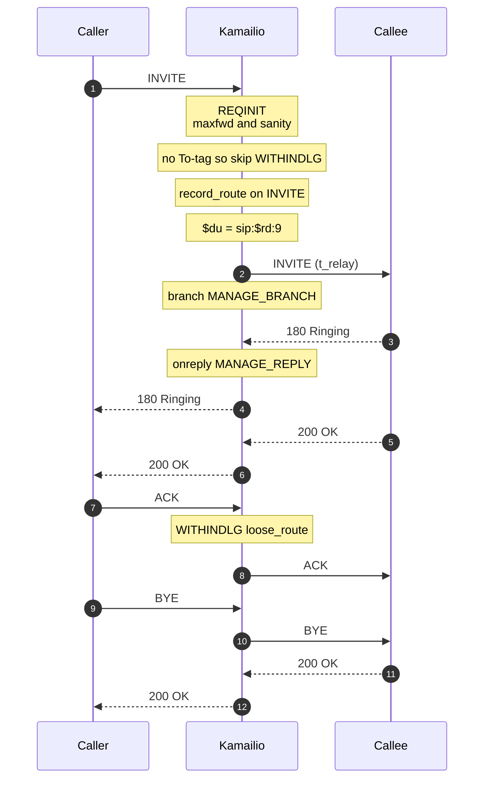
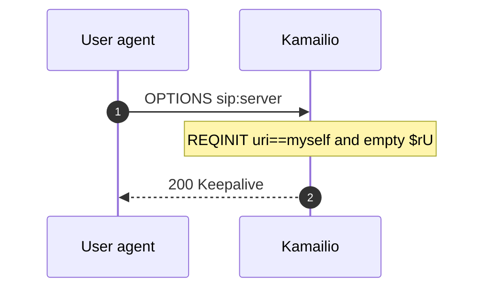

# BareBone SIP Server

A minimal Kamailio instance that answers local OPTIONS, record-routes dialog-forming requests, and
relays everything else with `t_relay()`. There is no registrar, no NAT rewrite and no media proxy —
the destination is taken from the request URI host, rewritten onto port 9, and forwarded.

The routing script is [`kamailio.cfg`](kamailio.cfg).

## Call flow

An initial INVITE is checked, record-routed and relayed. In-dialog ACK and BYE follow the
Record-Route set, so they come back through this server rather than going end to end.

## What each route does

| Route | When it runs |
|-------|----------------|
| `REQINIT` | Every request. Drops known scanners, enforces Max-Forwards, answers a local OPTIONS with `200 Keepalive`, and rejects malformed SIP. |
| `WITHINDLG` | Requests that already have a To-tag. Follows the Record-Route set with `loose_route()`, record-routes in-dialog NOTIFY, and relays a stateful ACK after a failure. |
| `RELAY` | Arms `MANAGE_BRANCH`, `MANAGE_REPLY` and `MANAGE_FAILURE`, then calls `t_relay()`. |
| `MANAGE_BRANCH` | Each outgoing branch, logging the new `$ru`. |
| `MANAGE_REPLY` | Each incoming reply. |
| `MANAGE_FAILURE` | Negative final replies, unless the transaction was cancelled. |

A request with no user part in the R-URI is answered locally with `484 Address Incomplete` and is
never relayed.

## OPTIONS keepalive

When the request is OPTIONS, the R-URI is this server, and there is no user part, Kamailio answers
itself instead of proxying:

